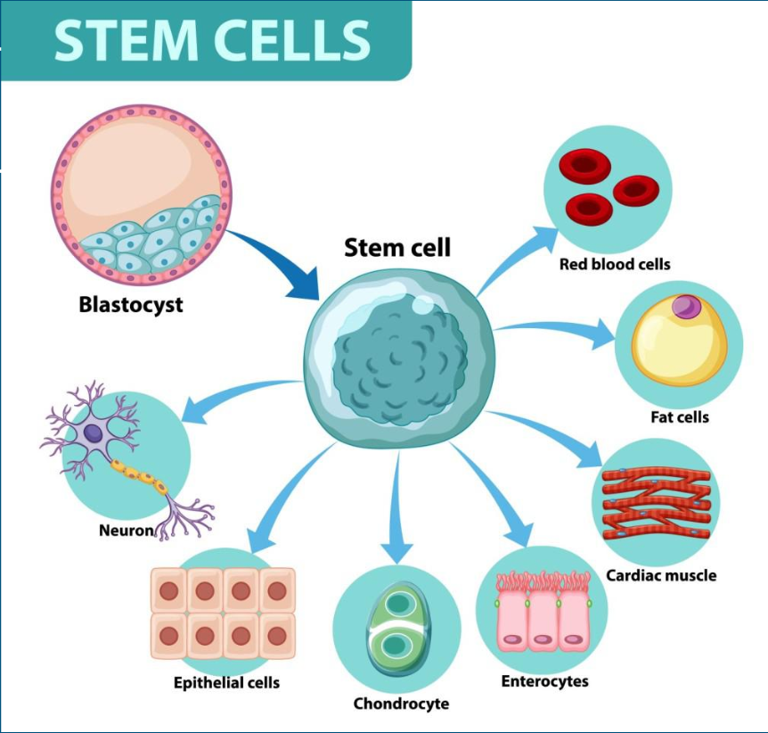
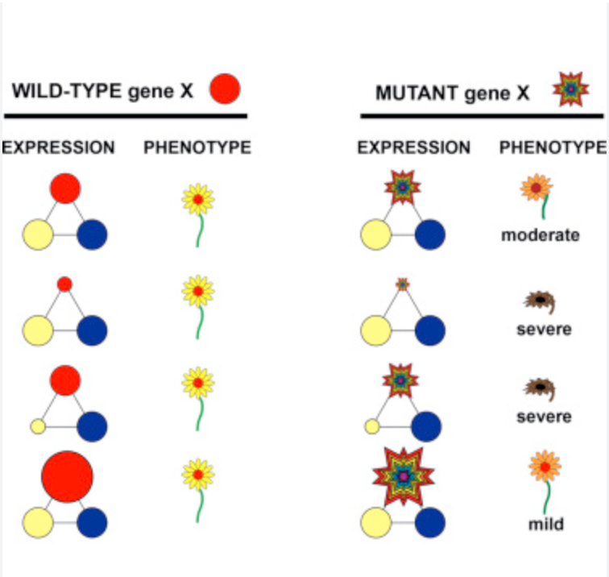
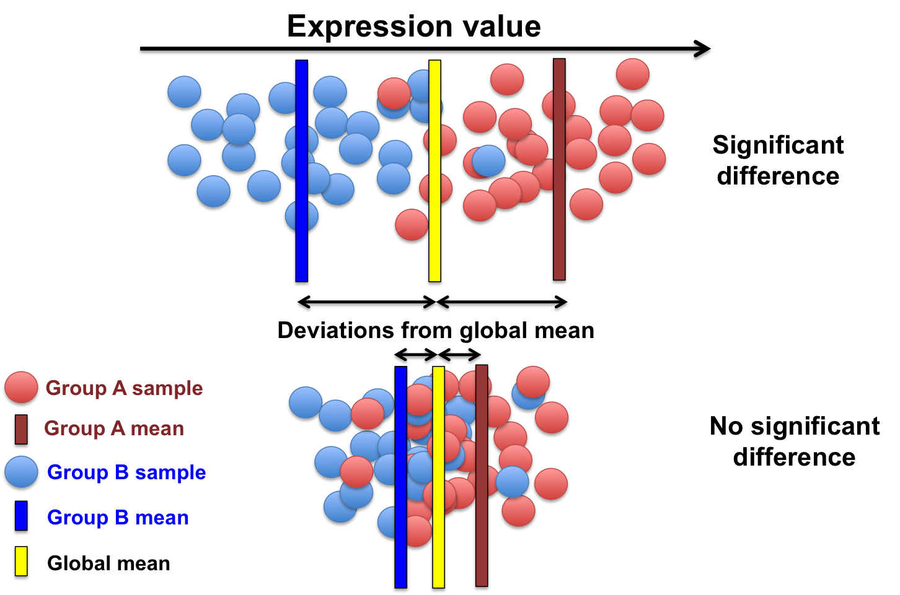
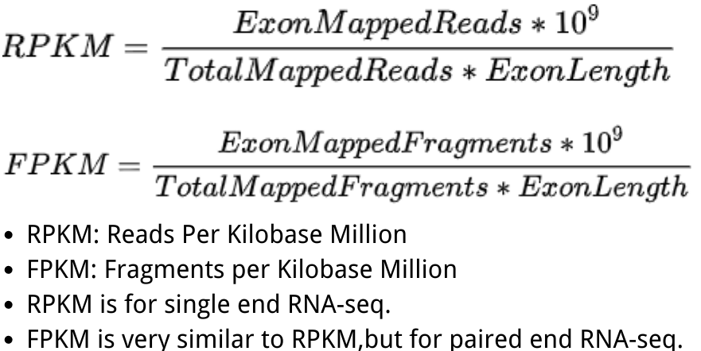
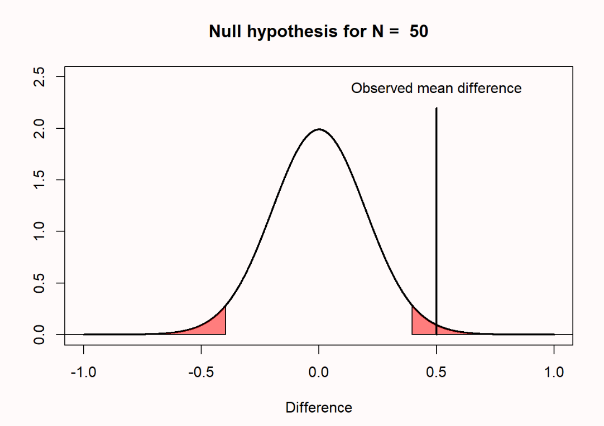
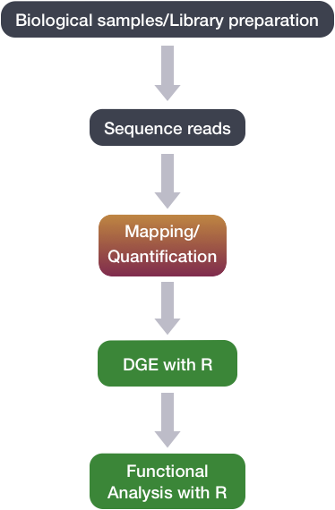

# Differential and Enrinchment Analysis with GSEA (Gene Set Enrichment Analysis)
1. [Introduction: Why?](#231) 
    1.1. [Differential Expression and Differential Analysis of Genes](#2311) 
    2.2. [Gene Set Enrichment Analysis](#2312)
2. [Differential Gene Expression Analysis: How?](#232) 
    2.1. [General Workflow](#2321) 
    2.2. [Methods and Methods comparison](#2322)
3. [Gene Set Enrichment Analysis: How?](#233)

## 1. Introduction
Have you wondered about how different kinds of cells in our body are developed despite their similar DNA composition? Have you considered why some patients die from a particular disease, while some do not?
    Differential Development of cell  |  Different phenotypes 
:-------------------------:|:-------------------------:
 |  

A fundamental concept underlying those phenomenon is the **Differential Expression of genes**. Genes are expressed differentially under different conditions to allow for different combinations of proteins and activation of certain biological pathways. Analyzing **differential expression of a set of genes** under different conditions can uncover the mystery behind development of stem cells and the cause of diseases [4]. 

Tools like **GSEA** can help us achieve this goal. However, before we dive deeper, let's start with some *basic concept review*. 

#### 1) Differential Expression and Differential Analysis of Genes

> **Differential Expression of genes** is *a evident change in read counts or expression level of genes under different conditions* [1]. 

Let's make an analogy here to help to understand this concept better. Let's consider different kinds of genes as different kinds of the lego building block.

It's intuitive that you need many white lego blocks to build a cloud lego while some white lego blocks to build the black cat for its eyes. 
Lego cloud           |  Lego Cat
:-------------------------:|:-------------------------:
 |  

In different biological conditions, the same gene will be expressed in different amounts based on needs. This phenomenon is the differential expression of the gene. 

> **Differential analysis** is to *analyze significant change in gene expression level of **a gene** under different biological conditions*.[5]

 [5]

As its name, differential analysis is computational method used to detect **evident change of gene expression of *a gene* under different conditions**, **or between two phenotype**[2]. It will require inputs like raw counts of gene expression in different conditions and conduct statistical analysis (like t-test) to check if the difference is statistically significant. 
 
#### 2) Gene Set Enrichment Analysis

- **Gene Set Enrichment Analysis** is to *analyze evident change in expression level of **a priori sets of gene** in different conditions* [3]. 

 [3]

Going back to our lego analogy, we know that different kinds of lego products consist of different combinations of lego building blocks. Knowing how many blocks we have for a certain product can help us foresee the look of it to some degree. 

On a similar note, differential expression of a set of genes can correlate with certain phenotypes of organisms. That's why we want to use gene set enrichment analysis, which we use statistical method to check if there is **evident change in expression of *a sets of gene* under different biological conditions**. 

## 2. Differential Gene Expression Analysis: How?
From the concept review, you probably can see how differential gene expression analysis is a necessary previous step of GSEA. 

To check if a set of genes is expressed differentially, we need to determine if a gene is expressed differentially first. Because we want to focus on GSEA in this chapter, let's take some time to go through the general workflow of DGE (differential gene expression analysis). 

#### 1) General Workflow 
The procedure of DGE can be generally concluded as follow: 
- 1. Normalization 
- 2. Statistical Test
- 3. P value check (P < 0.05, change is statistically significant; otherwise, it is not)

Let's dive into details one by one. 
1. **Normalization**</a>
   
   In RNA-seq downstream analysis, we will know how many reads are mapped to particular genes (that can be roughly taken as a measure of expression level sometimes). 
   

 
   
   *However, count of reads does not necessarily reflect the actual expression level of a gene.*

   To be specific, it's much easier for a gene that is *longer* and located in *DNA has higher counts of reads mapping* to have more reads mapped to it. Therefore, we need to take **gene length** and **library size** into consideration. That's why we need to first conduct normalization to make sure we get a valid expression level from input counts data. Common strategy and equations used for normalization are presented below. [BENG183 Lecture]

   

 

3. **Statistical Test**</a>

   We only care about **evident** change in expression level under different conditions. Thus, to make sure the difference in value is not caused by chance, we need to conduct a statistical test, usually a t-test, to compare and make sure the change in expression level under different conditions is significant.

   

 [5]

4. **P Value Check**</a>

   To check significance, we will use p value generated from t-test and 0.05 as threshold to determine its significance
   
   **If P < 0.05, change is statistically significant; otherwise, it is not significant.**

   

 

> Based on these general ideas, we'll walk through one of the most popular techniques for Differential Analysis and then briefly introduce other methods, as well as how to choose tools that work best for GSEA.

## 2.1 General Workflow

Before we can use GSEA, we first need to perform our differential gene expression analysis separately. Luckily, DGE is a well established protocol with a plethora of tools available to help us unlock the potential of differential analysis. While we’ll dive deeper into some of these tools later as well as how you can make the seemingly difficult decision on which one to pick, let’s first discuss some vital steps leading up to DGE analysis.

 

From previous chapters, we should already be familiar with the general RNA sequencing analysis pipeline outlined above, but just for the sake of review let’s discuss some of the key steps. We’ll begin with our RNA-seq data as sequence reads and run these through FASTQC for quality control. Next, we’ll map our reads to the reference genome, and often this step will be conducted using STAR. Lastly, before DGE we will do expression quantification, which can be performed in featureCounts. [BENG183 Lecture] If any of these steps are unclear, feel free to take a minute and revisit these earlier topics. At this stage, you’re ready to take the next step with differential gene expression analysis - so let’s dive into the methods that make it all work.

## 2.3.3 Hi-C
Hi-C is the highest through-put version of 3C-derived technologies. Due to the decreasing cost of 2nd generation sequencing, hi-c is widely used.

The principle of Hi-C can be illustrated as:

##### Hi-C critical steps [8] 
- Fixation: keep DNA conformed
- Digestion: enzyme frequency and penetratin
- Fill-in: biotin for junction enrichment
- Ligation: freeze interactions in sequence
- Biotin removal: junctions only
- Fragment size: small fragments sequence better
- Adapter ligation: paired-end and indexing
- PCR: create enough material for flow cell

##### Hi-C derived techniques 
- Hi-C original: [Lieberman-Aiden et al., Science 2010](doi: 10.1126/science.1181369)
- Hi-C 1.0: [Belton-JM et al., Methods 2012](doi: 10.1016/j.ymeth.2012.05.001)
- In situ Hi-C: [Rao et al., Cell 2014](doi: 10.1016/j.cell.2014.11.021)
- Single cell Hi-C: [Nagano et al., Genome Biology 2015](https://doi.org/10.1186/s13059-015-0753-7)
- DNase Hi-C [Ma, Wenxiu, Methods et al](https://www.ncbi.nlm.nih.gov/pubmed/25437436)
- Hi-C 2.0: [Belaghzal et al., Methods 2017](https://www.ncbi.nlm.nih.gov/pubmed/28435001)
- DLO-Hi-C: [Lin et al., Nature Genetics 2018](https://doi.org/10.1038/s41588-018-0111-2)
- Hi-C improving: [Golloshi et al., Methods 2018](https://www.biorxiv.org/content/biorxiv/early/2018/02/13/264515.full.pdf)
- Arima 1-day Hi-C: [Ghurye et al., BioRxiv 2018](https://www.biorxiv.org/content/early/2018/02/07/261149)

## 2.3.4 ChIA-PET 
ChIA-PET is another method that combines ChIP and pair-end sequencing to analysis the chromtin interaction. It allows for targeted binding factors such as: estrogen receptor alpha, CTCF-mediated loops, RNA polymerase II, and a combination of key architectural factors. on the one hand, it has the benefit of achieving a higher resolution compared to Hi-C, as only ligation products involving the immunoprecipitated molecule are sequenced, on the other hand, ChIA-PET has systematic biases due to ChIP process:
- Only one type of binding factor selected
- Different antibodies
- ChIP conditions

## 2.3.5 Selected methods comparison 
<table>
 <tbody>
    <tr>
        <th>Method</td>
        <th>Targets</td>
        <th>Resolution</td>
        <th>Notes</td>
    </tr>
    <tr>
        <td>3C <a href="http://refhub.elsevier.com/S2001-0370(17)30093-4/rf0535">[3]</a></td>
        <td>one-vs-one</td>
        <td>~1–10 kb </td>
        <td><ul><li>Sequence of bait locus must be known</li><li>Easy data analysis</li><li>Low throughput</li></ul></td>
    </tr>
    <tr>
    <td>4C <a href="http://refhub.elsevier.com/S2001-0370(17)30093-4/rf0545">[4]</a></td>
    <td>one-vs-all</td>
    <td>~2 kb</td>
    <td><ul><li>Sequence of bait locus must be known</li><li>Detects novel contacts</li><li>Long-range contacts</li></ul></td>
    </tr>
    <tr>
    <td>5C <a href="http://refhub.elsevier.com/S2001-0370(17)30093-4/rf0550">[5]</a></td>
    <td>many-vs-many</td>
    <td>~1 kb</td>
    <td><ul><li>High dynamic range</li><li>Complete contact map of a locus</li><li>3C with ligation-mediated amplification (LMA) of a ‘carbon copy’ library of oligos designed across restriction fragment junctions of interest
3C</li></ul></td>
    </tr>
    <tr>
    <td>Hi-C <a href="http://refhub.elsevier.com/S2001-0370(17)30093-4/rf0300">[6]</a></td>
    <td>all-vs-all</td>
    <td>0.1–1 Mb</td>
    <td><ul><li>Genome-wide nucleosome core positioning</li><li>Relative low resolution</li><li>High cost</li></ul></td>
    </tr>
    <tr>
    <td>ChIA-PET <a href="http://refhub.elsevier.com/S0168-9525(15)00063-3/sbref1405">[7]</a></td>
    <td>Interaction of whole genome mediated by protein</td>
    <td>Depends on read depth and the size of the genome region bound by the protein of interest</td>
    <td><ul><li>Lower noise with ChIP</li><li>Biased method since selected protein</li></ul></td>
    </tr>
 </tbody>
</table>

# Referrence
[1] Anjum A, Jaggi S, Varghese E, Lall S, Bhowmik A, Rai A. Identification of Differentially Expressed Genes in RNA-seq Data of Arabidopsis thaliana: A Compound Distribution Approach. J Comput Biol. 2016 Apr;23(4):239-47. doi: 10.1089/cmb.2015.0205. Epub 2016 Mar 7. PMID: 26949988; PMCID: PMC4827276.  

[2] Abbas, M., EL-Manzalawy, Y. Machine learning based refined differential gene expression analysis of pediatric sepsis. BMC Med Genomics 13, 122 (2020). https://doi.org/10.1186/s12920-020-00771-4 

[3] Gene Set Enrichment Analysis Website. https://www.gsea-msigdb.org/gsea/doc/GSEAUserGuideFrame.html 

[4] Differential Gene Expression | Definition & Analysis. https://study.com/academy/lesson/differential-gene-expression-definition-examples.html#:~:text=Differential%20gene%20expression%20defines%20the,of%20liver%20and%20skin%20cells  

[5] Comparing experimental conditions: differential expression analysis. https://biocorecrg.github.io/CRG_Bioinformatics_for_Biologists/differential_gene_expression.html. 

[6] Lieberman-Aiden E, van Berkum NL, Williams L, Imakaev M, Ragoczy T, Telling A, et al. Comprehensive mapping of long-range interactions reveals folding principles of the human genome. Science 2009;326(5950):289–93. 

[7] Fullwood, M.J. et al. (2009) An oestrogen-receptor-alpha-bound human chromatin interactome. Nature 462, 58–64. 

[8] https://github.com/hms-dbmi/hic-data-analysis-bootcamp/blob/master/HiC-Protocol.pptx.

